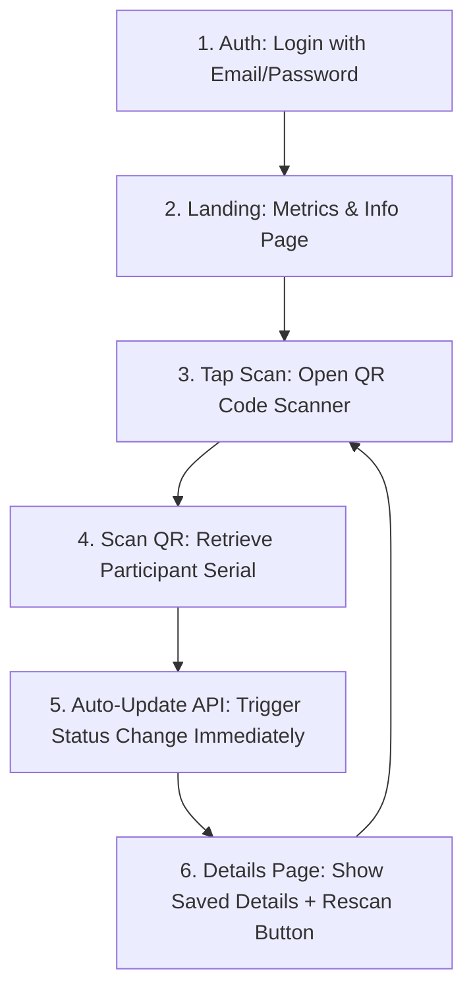
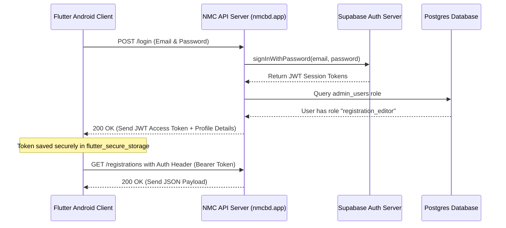

# Product Requirement Document (PRD) - NMC 2026 Admin Android App

This document outlines the requirements, architecture, user flows, and technical specifications for the National Mathematics Carnival 2026 Android Admin Application.

---

## 1. Project Overview & Objective

The **NMC 2026 Admin Android Application** is a secure, high-performance mobile utility designed for on-ground event volunteers and coordinators to manage participant status tracking in real time. 

### Core Goals:
1.  **Speed**: Quick scanning of participant QR codes (containing their unique registration Serial).
2.  **No-Click Auto-Update**: Instantly triggers database patch updates on scan without requiring coordinator confirmation clicks, optimizing queue processing times.
3.  **Auditability**: Instant recording of which administrator performed each update.
4.  **Security**: Hardened Bearer Token request verification using HTTPS.

---

## 2. Core Application Workflow

Coordinators scanning tickets on-ground operate in a high-throughput environment. The app is optimized for rapid operations:



1.  **Authentication**: The coordinator logs in via email and password (provided by the superadmin through the web admin panel).
2.  **Landing Page**: Defaults to the Metrics/Info page. Displays total counts of kits distributed, launch servings completed, and verified presence.
3.  **Open QR Code Scanner**: The coordinator selects their active scan mode (e.g. "Kit distribution", "Attendance tracking", or "Launch distribution") and launches the scanner.
4.  **Scan Code**: The coordinator holds the camera over the participant's QR code.
5.  **No Confirmation Auto-Update**: The app reads the `serial` number from the QR code and instantly executes the corresponding REST patch API call (e.g. `/api/admin/registrations/kit`) behind the scenes. No intermediate confirmation click is required.
6.  **Result View & Rescan**: The app presents the participant's full profile details along with a clear green "Successfully Updated" success banner and a prominent **Rescan** button to immediately re-enable the camera.

---

## 3. Technology Stack & Packages

The application will be built using **Flutter** to leverage modern Material 3 design paradigms, native performance, and rapid UI development.

### Recommended Packages:
*   **State Management**: `flutter_riverpod` (or `provider`) for modular, testable reactive state.
*   **Networking**: `dio` (for robust HTTP client requests, base config, headers, and error interceptors).
*   **Local Storage**: `flutter_secure_storage` (for encrypted token persistence like JWTs and admin records).
*   **Barcode Scanning**: `mobile_scanner` (high-performance camera barcode and QR-code scanner).
*   **UI Components**: Material 3 icons, Google Fonts (`Inter`, `Outfit`), and custom animations with `lottie`.

---

## 4. Environment Configurations (`.env`)

Create a `.env` file in the Flutter root directory containing parameters for endpoints:

```ini
# Core Configuration
NMC_API_BASE_URL=https://www.nmcbd.app/api/admin
```

---

## 5. Security & Authentication Flow

### Hardened Authorization Schema:


1.  **Login**: User inputs email and password. App makes a request to `POST https://www.nmcbd.app/api/admin/login` with `{ "email": "admin@example.com", "password": "securepassword" }`.
2.  **Persistence**: The returned `session.access_token` JWT is encrypted and stored locally using `flutter_secure_storage`.
3.  **API Requests**: For all subsequent NMC REST API calls, include the access token in the headers:
    `Authorization: Bearer <access_token>`
4.  **Token Expiration**: On receiving a `401 Unauthorized` or `403 Forbidden` response, the app should wipe local secure storage and redirect the user back to the Login Page.

---

## 6. UI/UX Design System & Theme

To match the premium dashboard aesthetics, implement a unified dark-mode-first styling hierarchy:

*   **Primary Background**: Sleek deep obsidian/coal color (`#0c0f17`).
*   **Surfaces/Cards**: Dark glassmorphic translucency (`rgba(255, 255, 255, 0.03)` with thin borders `#ffffff10`).
*   **Accents**: Vibrant Neon Violet/Blue (`#6366f1` / `#4f46e5`) and Amber Alert Cyan (`#0dcaf0`).
*   **Typography**: Clean sans-serif font pairing (e.g. `Outfit` for large numbers/headers and `Inter` for standard details).
*   **Animations**: Smooth scale transitions on button hover/taps, and slide transitions when navigating panels.

---

## 7. Required Application Pages & Views

### A. Authentication View (Login Page)
*   **Layout**: Beautiful logo header card, centered credentials form.
*   **Controls**: Input fields for Admin Email and Password (provided by superadmin), and a login button.
*   **Features**: Validation flags, password hide/show toggle, loading spinner overlays.

### B. Dashboard / Metrics Landing View (Default Page)
*   **Layout**: Grid of Material 3 glassmorphism cards showing registration metrics totals:
    *   **Kit Collected**: `Total Yes / Total No`
    *   **Attendance**: `Present / Absent`
    *   **Launch Served**: `Yes / No`
*   **Controls**: Scan Select configuration (toggles active target: Kit, Attendance, or Launch) and a prominent Floating Action Button (FAB) at the center-bottom to launch the Live Camera Scanner view.

### C. Live Scanner View (QR Scanner Page)
*   **Layout**: Full-screen camera scanner viewport with a neon scanner boundary box overlay.
*   **Controls**: Flashlight toggle button, manual serial entry input fallback.
*   **Features**: On detecting a registration QR code (e.g. text containing `260001` serial ID), the scanner stops, triggers a subtle haptic vibrate feedback, and **automatically** calls the matching status update API route (e.g. `PATCH /registrations/kit` with `is_kit_coollect: true`) without requiring coordinator validation clicks. It then immediately redirects to the Participant Detail view.

### D. Participant Detail & Update View (Result View)
*   **Layout**: Scrollable, card-grouped details section showing:
    1.  **Banner**: Prominent green alert card showing "Successfully Updated" (or amber message if already updated).
    2.  **Profile**: Scanned participant Name, Serial, Institution, Class/Level, Event, and T-shirt size.
    3.  **Audit**: Last updated time stamp and the admin name who conducted the scan.
    4.  **Toggles**: Inline manual status toggle switch fallback options.
*   **Controls**: Large, primary neon **Rescan** button. Tapping the button returns the coordinator instantly to the scanner viewport to scan the next participant ticket.

---

## 8. API Integration Specifications

### Endpoint 1: Get Registrations JSON
*   **Path**: `GET https://www.nmcbd.app/api/admin/registrations`
*   **Header**: `Authorization: Bearer <access_token>`
*   **Action**: Use to sync local database/cache or search offline when on-site connectivity fluctuates.

### Endpoint 2: Update Kit Collection
*   **Path**: `PATCH https://www.nmcbd.app/api/admin/registrations/kit`
*   **Header**: `Authorization: Bearer <access_token>`
*   **Body**:
    ```json
    {
      "serial": "260001",
      "is_kit_coollect": true
    }
    ```
*   **Response Response (200 OK)**:
    ```json
    {
      "success": true,
      "updated": true,
      "serial": "260001",
      "updatedBy": "Mohatamim Haque",
      "updatedAt": "2026-07-14T16:00:00.000Z"
    }
    ```

### Endpoint 3: Update Launch Status
*   **Path**: `PATCH https://www.nmcbd.app/api/admin/registrations/launch`
*   **Header**: `Authorization: Bearer <access_token>`
*   **Body**:
    ```json
    {
      "serial": "260001",
      "is_collect_launch": true
    }
    ```
*   **Response Response (200 OK)**:
    ```json
    {
      "success": true,
      "updated": true,
      "serial": "260001",
      "updatedBy": "Mohatamim Haque",
      "updatedAt": "2026-07-14T16:00:00.000Z"
    }
    ```

### Endpoint 4: Update Attendance / Presence
*   **Path**: `PATCH https://www.nmcbd.app/api/admin/registrations/present`
*   **Header**: `Authorization: Bearer <access_token>`
*   **Body**:
    ```json
    {
      "serial": "260001",
      "is_present": true
    }
    ```
*   **Response Response (200 OK)**:
    ```json
    {
      "success": true,
      "updated": true,
      "serial": "260001",
      "updatedBy": "Mohatamim Haque",
      "updatedAt": "2026-07-14T16:00:00.000Z"
    }
    ```
