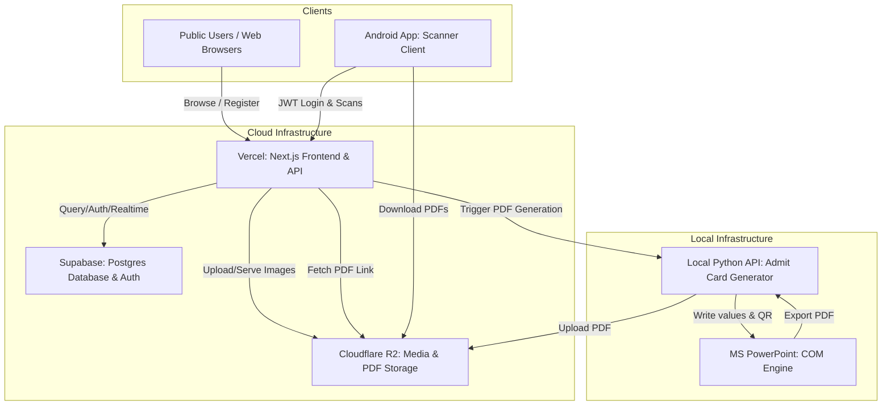
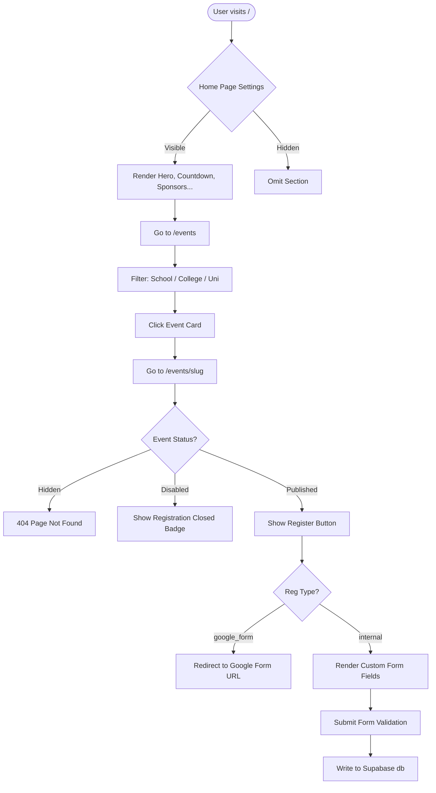
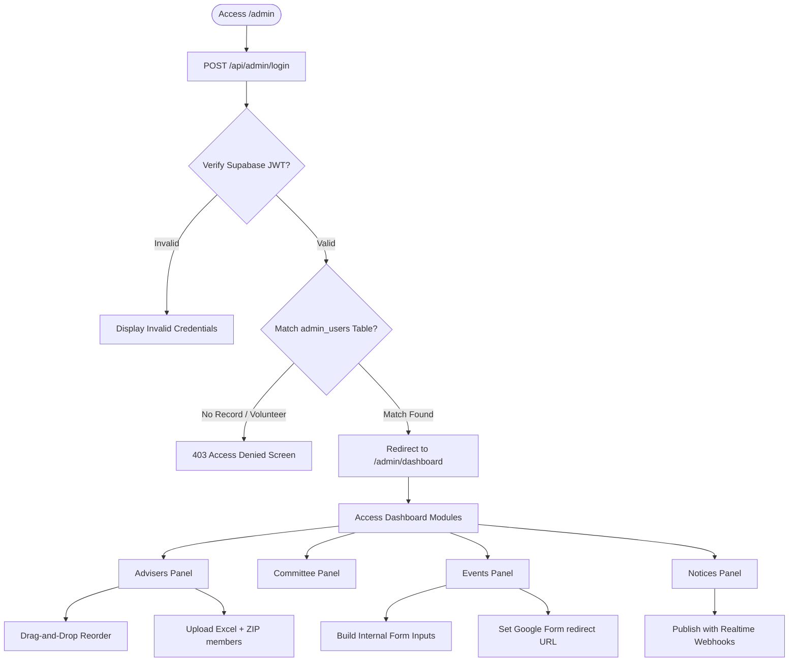
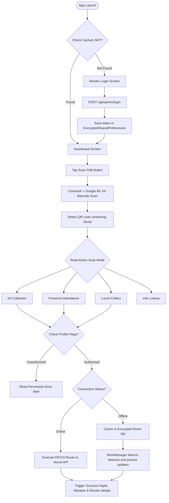
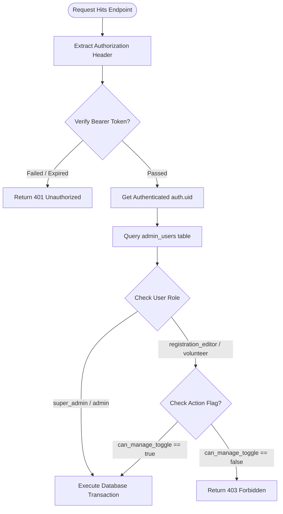

# National Mathematics Carnival 2026 — Documentation Ecosystem

Welcome to the official developer and operator documentation for the **National Mathematics Carnival 2026 (NMC 2026)** ecosystem, organized by **Math Club, DUET**. 

This documentation is designed to guide future developers, system administrators, and event organizers in maintaining, updating, and repurposing the platform for future events.

---

## 1. System Overview & Architecture

The NMC 2026 platform consists of three main components:
1. **Next.js Web Application & Admin Panel**: The public-facing site where participants view events, announcements, and schedules. It includes a math-themed CMS (Content Management System) where admins manage site settings, adviser listings, committee members, and registrations.
2. **FastAPI Admit Card Generator ("Autocrat")**: A local Python microservice that uses COM automation to fill participant information into a PowerPoint (`.pptx`) template, renders a dynamic QR code based on their serial number, exports the result to PDF, and uploads it to Cloudflare R2.
3. **Admin Android Mobile App**: A native Kotlin application used on-site by event volunteers and admins for quick QR code check-ins (attendance, kit collections, lunch distribution) with offline-first support.

### System Integration Flow

---

## 2. Documentation Map

Please refer to the following documents for deep-dive instructions:

| Document | Focus Area | Key Contents |
| :--- | :--- | :--- |
| **[Setup & Deployment](docs/setup_and_deployment.md)** | Getting Started | Local development setup, environment variables, Vercel deployments, and setting up the Python PDF generator. |
| **[Architecture & APIs](docs/architecture_and_apis.md)** | Technical Specifications | Supabase DB tables, role-based permission flags, custom management scripts, and REST API contract details. |
| **[Database Schema & ER](docs/database_schema.md)** | Relational Structure | Complete entity-relationship model diagrams, foreign key constraint tables, delete cascade paths, and stored SQL procedure flows. |
| **[Admin Panel CMS](docs/admin_panel.md)** | CMS Operations | Complete guide to the admin panel dashboard, site personalization, content sliders, event forms builder, Excel/ZIP imports, and schedule manager. |
| **[Public Site Pages](docs/public_website.md)** | Site Structure | Interactive features, query configurations, map hooks, notice streams, category filters, and layout behaviors for all public views. |
| **[Event Repurposing Guide](docs/event_repurposing.md)** | Event Operations | Checklist for configuring a new event, editing PowerPoint templates, changing branding/colors, seeding new users, and clearing data. |
| **[Android App Specifications](docs/android_app_specification.md)** | Mobile App | Kotlin stack details, offline Room+SQLCipher caching structure, QR scanning viewports, and native PDF rendering logic. |
| **[Legacy PRD Requirements](docs/nmc_prd.md)** | Requirements | Historical Product Requirement Document outlining the initial system architecture design scopes. |

---

## 3. Core Tech Stack Recap

*   **Web Frontend & Backend API**: Next.js 14 (App Router), TypeScript, Tailwind CSS, Framer Motion, shadcn/ui.
*   **Database & Auth**: Supabase (PostgreSQL), Row Level Security (RLS) policies, Realtime.
*   **Storage**: Cloudflare R2 bucket (S3-compatible) with `Sharp` WebP compression.
*   **PDF Microservice**: FastAPI, Python, pythoncom/win32com, python-pptx, qrcode.
*   **Mobile Application**: Kotlin, Jetpack Compose, Material 3, CameraX, Google ML Kit Barcode Scanning, Room SQLite + SQLCipher, Retrofit 2.

---

## 4. Operational Flowcharts & Page Architectures

The following diagrams illustrate the detailed page routing flows, user interaction steps, and permissions enforcement checklist.

### A. Public Web Flow & Registration Lifecycle

---

### B. CMS Admin Gatekeeper & Control Flows

---

### C. Native Android Volunteer Flow & Sync Engine

---

### D. API Endpoint Security & Permissions Authorization

---

## Developer Credit & Contact Details

This platform was developed and is maintained by:
*   **Name**: Mohatamim Haque
*   **Phone (WhatsApp)**: +8801518749114 (01518749114)
*   **Primary Email**: mohatamimhaque7@gmail.com
*   **Alternative Email**: mohatamimhaque@outlook.com
*   **Facebook**: [mohatamim44](https://facebook.com/mohatamim44)
*   **LinkedIn**: [mohatamim](https://linkedin.com/in/mohatamim)
*   **GitHub**: [mohatamimhaque](https://github.com/mohatamimhaque)
