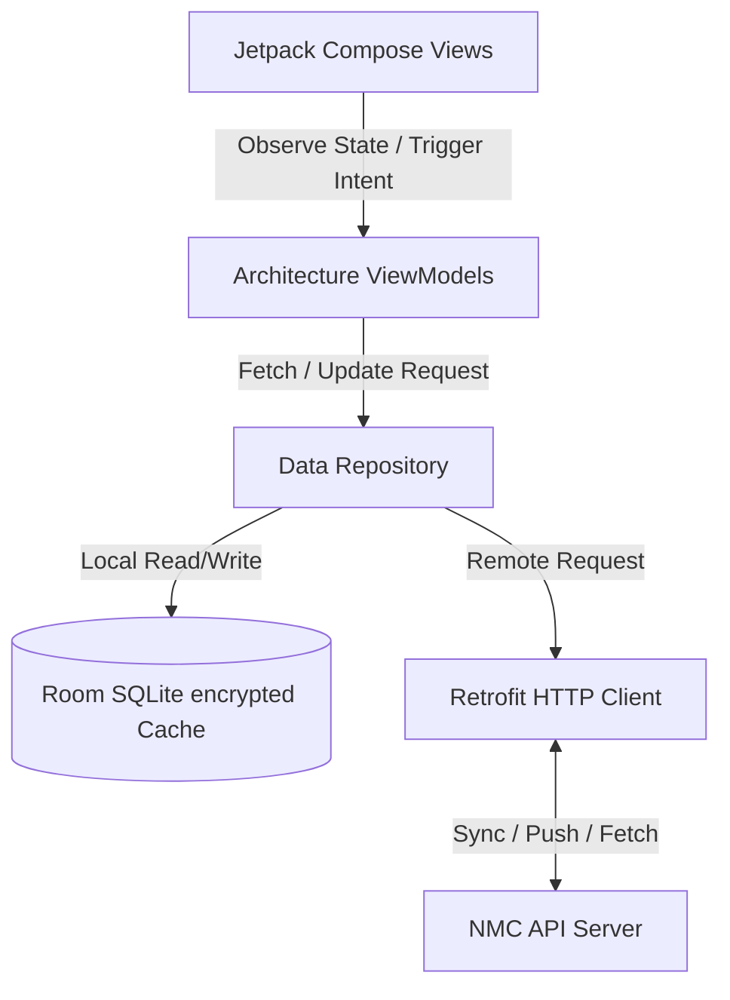
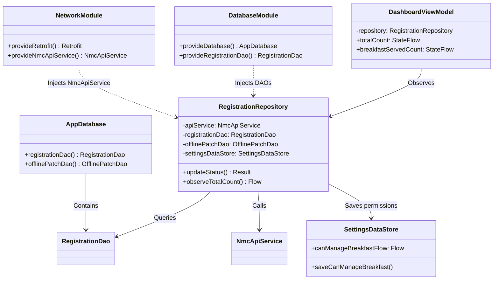
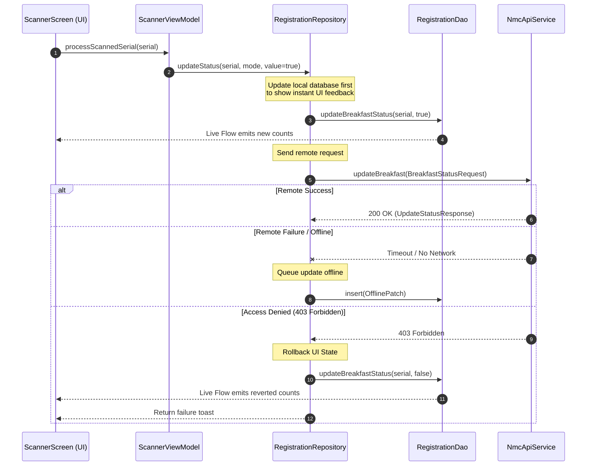

# NMC 2026 Admin Application - System Architecture

This document describes the software architecture, class design, data flows, and offline synchronization mechanisms of the **NMC 2026 Android Admin Application**.

---

## 1. Architectural Patterns

The application conforms to standard Android architecture principles, utilizing an **offline-first MVVM (Model-View-ViewModel)** structure combined with the **Repository pattern**.

### Components:
1.  **View Layer (Jetpack Compose)**: Declarative UI components that react to state changes in the ViewModel. Views do not directly communicate with databases or networking clients.
2.  **ViewModel Layer (Jetpack ViewModels)**: Manages UI state using `StateFlow` and handles background operations within `viewModelScope` coroutine contexts.
3.  **Repository Layer (Data Repositories)**: The single source of truth for UI data. Decides dynamically whether to fetch from local Room databases, trigger remote API calls, or coordinate background offline synchronization.
4.  **Local Data Source (Room DB encrypted with SQLCipher)**: Provides encrypted on-device persistence for offline resiliency.
5.  **Remote Data Source (Retrofit API Service)**: Connects to the event backend API.

---

## 2. Core Class & Injection Graph

The project utilizes **Dagger Hilt** for dependency injection. The diagram below illustrates class associations and construction dependencies:

---

## 3. Dynamic Data Flows

### A. Real-time Scanner Check-In Flow
This flow represents the check-in process when scanning a QR code ticket:

---

## 4. Offline Synchronization (WorkManager)

The application handles on-ground connectivity loss seamlessly using an offline queue.

1.  **Queue Insertion**: When status changes are triggered offline, the repository saves the operation as an `OfflinePatch` in the `offline_patches_queue` database table.
2.  **Sync Execution**:
    -   `SyncWorkManager` registers a task constrained to run exclusively on `NetworkType.CONNECTED`.
    -   WorkManager executes the sync loop sequentially, processing patches in the queue and verifying authorization tokens.
    -   Successfully synchronized elements are immediately dropped from the local offline queue.

  Developed by <b>Mohatamim Haque</b>  
  
  
  
  
  
  

