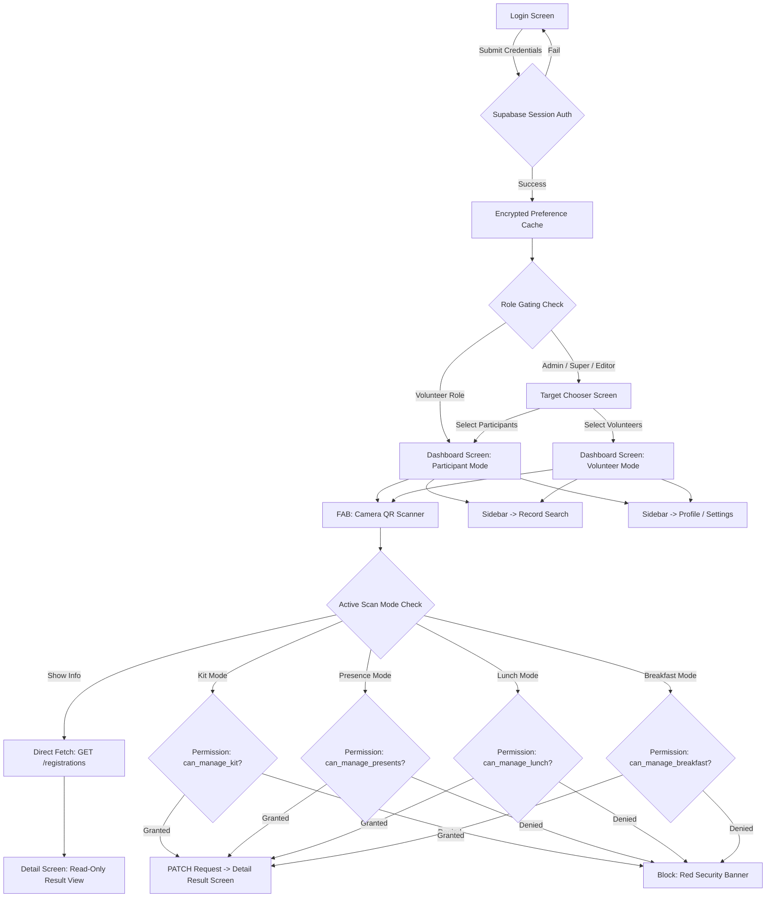

# NMC 2026 Admin Application - User Manual

Welcome to the **National Mathematics Carnival 2026 Android Admin Application**. This manual details the features, permissions, and workflows of the application for Staff, Volunteers, Registration Editors, Administrators, and Super Administrators.

---

## 1. Application Architecture & Permission Flow Diagram

The diagram below details the authentication gating, target redirection logic, feature routing, and permission-based scanner access validation:

---

## 2. Dynamic Feature Locations & Permissions Map

Below is a directory map of where every administrative tool exists inside the UI, which permission flag is required to access it, and step-by-step operational instructions.

### A. Management Mode Target Chooser
*   **Where it exists**: Shown immediately after authentication (Login) or by clicking **Switch Target** inside the Sidebar navigation drawer.
*   **Permissions required**: `can_manage_volunteers` OR `isSuperOrAdmin` OR `isEditor` (Volunteers without permission are redirected straight to Participant Dashboard).
*   **How to do it**: Tap the **Manage Participants** card to load student stats and database caches, or tap the **Manage Volunteers** card to manage worker cohorts.

### B. Live Statistics Dashboard
*   **Where it exists**: Default Home Screen after target chooser selection.
*   **Permissions required**: Visible to all logged-in users (statistics adapt dynamically depending on the selected management mode).
*   **How to do it**:
    -   To refresh statistics counts and profiles in real-time, **pull down** on the screen or tap the **Sync Icon** (top-right app bar).

### C. Live Barcode/QR Camera Scanner
*   **Where it exists**: Floating Action Button (FAB) at the bottom-center of the Dashboard.
*   **Permissions required**: Open access to all users. Permissions are checked dynamically *at the moment of scan* depending on the active mode:
    -   **Show Info (Read-Only)**: Open to all.
    -   **Kit Collections**: Requires `can_manage_kit` flag.
    -   **Attendance Presence**: Requires `can_manage_presents` flag.
    -   **Lunch Servings**: Requires `can_manage_lunch` flag.
    -   **Breakfast Servings**: Requires `can_manage_breakfast` flag.
*   **How to do it**:
    1.  Point the camera viewfinder overlay at the barcode or ticket QR code.
    2.  The scanner automatically processes the registration serial number and triggers the server request.
    3.  A green success banner is shown if the check-in is successful. If unauthorized, a red warning is shown.
    4.  Tap **Rescan** to return directly to scanning.

### D. Manual Detail Overrides
*   **Where it exists**: **Details Screen** (reached by scanning a code or searching a record).
*   **Permissions required**: Restricted strictly to **Admins** and **Superadmins** (`isSuperOrAdmin`).
*   **How to do it**:
    1.  On the details screen, scroll down to the **Status Overrides** section.
    2.  Toggle the switches (Kit, Presence, Lunch, Breakfast) to change status.
    3.  If an override is rejected by the server, the toggles revert on-screen automatically.

### E. User Permissions & Role Management
*   **Where it exists**: **My Profile Screen** (Sidebar Menu) -> **Manage Permissions** button.
*   **Permissions required**: Exclusive to **Super Administrators** (`super_admin`).
*   **How to do it**:
    1.  Select a user from the listings.
    2.  Adjust the role dropdown (`super_admin`, `admin`, `registration_editor`, `volunteer`).
    3.  Toggle permissions (Volunteers, Registrations, Kit, Presents, Lunch, Breakfast).
    4.  Tap **Save** to write modifications to the server.

---

## 3. Detailed Permissions & Security Matrix

The following table summarizes the granular actions associated with each database preference key flag:

| Permission Variable | Description & Capabilities | UI Access Location | Action Trigger |
|:---|:---|:---|:---|
| **`can_manage_volunteers`** | Authorizes searching, filtering, and detail views for volunteer staff cohorts. | Sidebar -> Choose Target / Record Search | Selecting "Volunteers Mode" |
| **`can_manage_registrations`**| Authorizes searching, detail views, and admit card rendering for participants. | Sidebar -> Choose Target / Record Search | Selecting "Participants Mode" |
| **`can_manage_kit`** | Authorizes scanning barcodes under **Kit Distribution** mode. | Settings -> Mode / Scanner view | Scanning QR under Kit Mode |
| **`can_manage_presents`** | Authorizes scanning barcodes under **Attendance Presence** mode. | Settings -> Mode / Scanner view | Scanning QR under Presence Mode |
| **`can_manage_lunch`** | Authorizes scanning barcodes under **Lunch Served** mode. | Settings -> Mode / Scanner view | Scanning QR under Lunch Mode |
| **`can_manage_breakfast`** | Authorizes scanning barcodes under **Breakfast Collection** mode. | Settings -> Mode / Scanner view | Scanning QR under Breakfast Mode |

### Implicit Permission Rules:
-   **Super Administrators (`super_admin`) & Administrators (`admin`)**: Possess global permissions implicitly.
-   **Registration Editors (`registration_editor`)**: Automatically granted permissions to view participants and manage all scanning categories (Kit, Presents, Lunch, and Breakfast).
-   **Volunteers (`volunteer`)**: Hold no default permissions and must have flags individually granted by a Super Admin.

---

## 4. Role-Based Capabilities Checklist

| User Task / Operations | Volunteer | Registration Editor | Administrator | Super Administrator |
|:---|:---:|:---:|:---:|:---:|
| Choose Target Redirection | ❌ * (Unless granted) |  |  |  |
| Read-Only Lookup Scan Mode |  |  |  |  |
| Kit Check-In Scan Mode | ❌ * (Unless granted) |  |  |  |
| Attendance Check-In Scan Mode| ❌ * (Unless granted) |  |  |  |
| Lunch Check-In Scan Mode | ❌ * (Unless granted) |  |  |  |
| Breakfast Check-In Scan Mode | ❌ * (Unless granted) |  |  |  |
| Manual Status Override Toggles| ❌ | ❌ |  |  |
| View Volunteer Unique IDs | ❌ | ❌ |  |  |
| Download Admit Card PDFs | ❌ * (Unless granted) |  |  |  |
| Export List Records to CSV | ❌ | ❌ |  |  |
| Edit User Roles & Access Toggles| ❌ | ❌ | ❌ |  |

*\* Note: Dynamically granted permission flags will override default role restrictions.*

---

  Developed by <b>Mohatamim Haque</b>  
  
  
  
  
  
  

