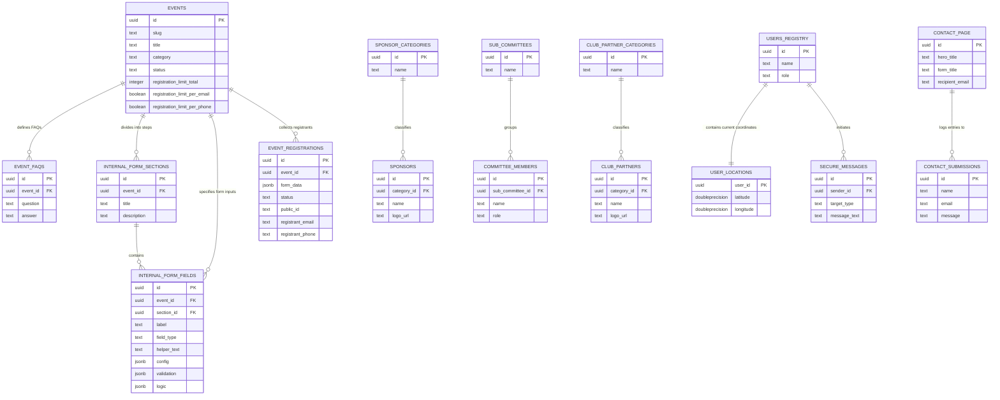
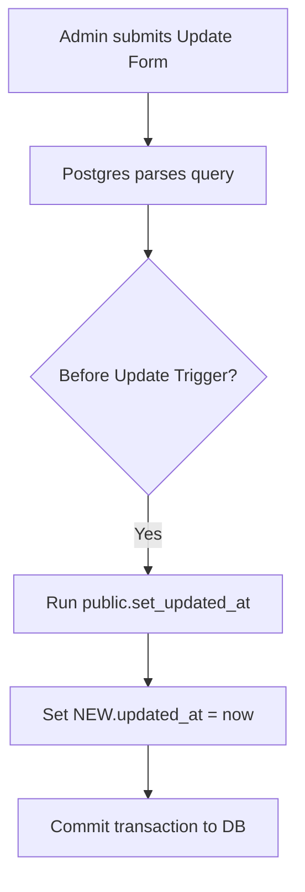
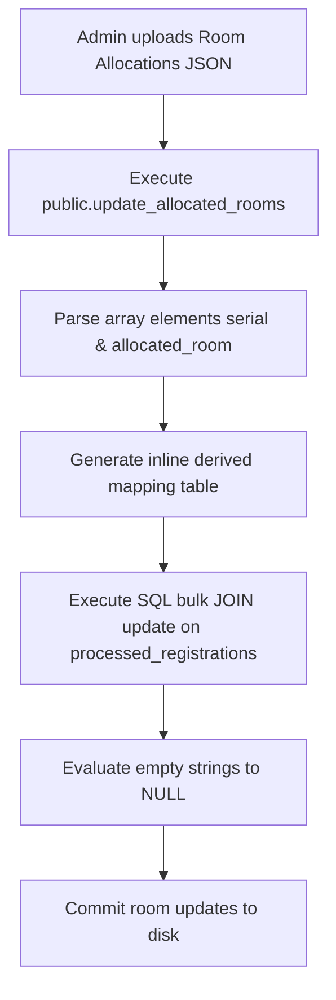
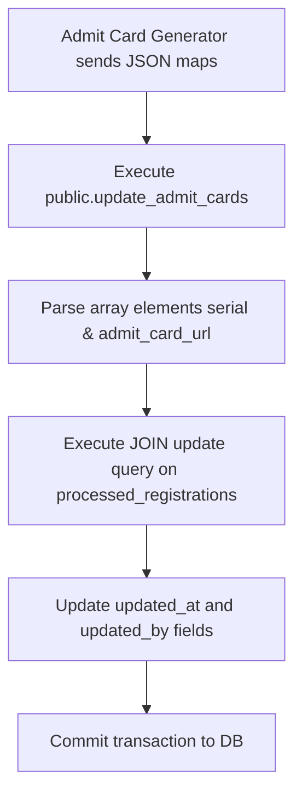

# Database Relational Model & ER Diagrams

This document details the PostgreSQL schema relationships, the Entity-Relationship (ER) diagram, and trigger-execution flowcharts for the NMC 2026 platform.

---

## 1. Entity-Relationship (ER) Diagram

The diagram below maps the complete relational model of the 40 database tables.

---

## 2. Table-to-Table Relationship References

The following table summarizes foreign key relationships and delete cascades:

| Primary (Parent) Table | Foreign (Child) Table | Linking Column | On Delete Action | Description |
| :--- | :--- | :--- | :--- | :--- |
| `events` | `event_faqs` | `event_id` | **CASCADE** | FAQs are auto-deleted if parent event is deleted. |
| `events` | `internal_form_sections` | `event_id` | **CASCADE** | Step sections are deleted if event is deleted. |
| `events` | `internal_form_fields` | `event_id` | **CASCADE** | Custom registration fields deleted if event is deleted. |
| `internal_form_sections` | `internal_form_fields` | `section_id` | **SET NULL** | Form fields remain; their section assignment is cleared. |
| `events` | `event_registrations` | `event_id` | **CASCADE** | Participant form submissions deleted if event is deleted. |
| `sponsor_categories` | `sponsors` | `category_id` | **SET NULL** | Sponsor cards stay intact; category gets unassigned. |
| `sub_committees` | `committee_members` | `sub_committee_id` | **CASCADE** | Member profiles auto-deleted if sub-committee is deleted. |
| `club_partner_categories`| `club_partners` | `category_id` | **SET NULL** | Partner logos stay intact; category unassigned. |
| `users_registry` | `user_locations` | `user_id` | **CASCADE** | Location tracking coordinates deleted if user is removed. |
| `users_registry` | `secure_messages` | `sender_id` | **CASCADE** | Sent messages deleted if user registry row is removed. |

---

## 3. Database Trigger Flowcharts

The database uses pl/pgsql triggers to manage operations in the background:

### A. Modified Time Auditor (`set_updated_at`)
Any update query triggering a row edit fires a before-update trigger to reset the `updated_at` timestamp.

### B. Bulk Room Allocation Handler (`update_allocated_rooms`)
A stored SQL procedure accepting a JSON array of participant serial numbers and room strings, performing high-speed updates in a single database transaction.

### C. Bulk Admit Card PDF Handler (`update_admit_cards`)
Fires when the admit card generator microservice successfully uploads a compiled PDF file to R2 storage, logging the public URL location to database records.

---

  Developed by <b>Mohatamim Haque</b>  
  
  
  
  
  
  

